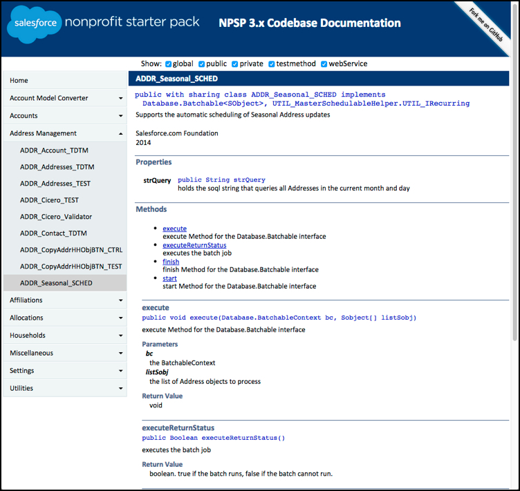

I first played with ApexDoc back in 2011, when I took the original code written by [Aslam Bari](http://techsahre.blogspot.com/2011/01/apexdoc-salesforce-code-documentation.html), and added some additional features to meet the needs of a nonprofit I was working with. 4 years later, I am working on the Salesforce Foundation's Nonprofit Starter Pack Team, and we want to document our source code for the developer community, so that people can more easily contribute to the [Nonprofit Starter Pack](http://github.com/SalesforceFoundation/Cumulus).  So I've revamped ApexDoc to include additional support for Apex language constructs, to provide a better navigation ui, and to format our pages more closely to what one sees with Salesforce's Apex documentation.

The [ApexDoc project on gitHub](http://github.com/SalesforceFoundation/ApexDoc) continues to be open source, and you can use it to document any of your Apex projects. It supports customizing the banner and styles to brand your site as you wish. Here you can see a sample page from the [Nonprofit Starter Pack 3 Documentation](http://developer.salesforcefoundation.org/Cumulus/ApexDocumentation/index.html) as provided by ApexDoc.
 

 
Some of the new features I really like include:

- all class, method, and property signatures link to the source code on your hosted repository
- nested classes are now supported and displayed on the parent class's page
- interfaces are now supported
- multiline descriptions are supported
- single-line ApexDoc comments now supported
- hierarchical menu of classes provided for navigation with the class-group concept
- class-group's can provide their own overview html page
- users can specify an html file for their banner, allowing more flexibility on presentation
- checkboxes provided to dynamically show/hide all items in that scope (global, public, private, etc.)
- methods table of contents provided near the top of each class's page

All the information about running ApexDoc and how you can format your code for ApexDoc are found in the repository's [readme](http://github.com/SalesforceFoundation/ApexDoc/blob/master/README.md).

I hope you like the new look (and new features) of ApexDoc!
